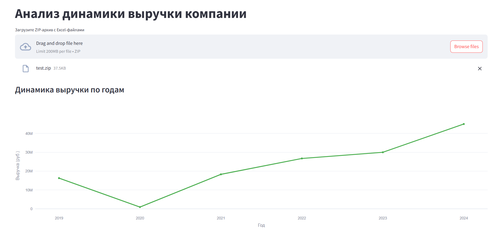
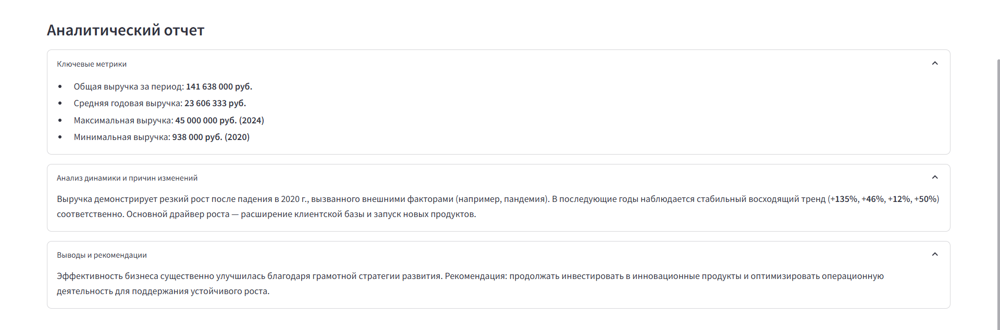

# Сервис анализа динамики выручки компании

Веб-сервис для анализа выручки компании по данным из Excel-файлов с интеграцией LLM.



## Возможности

- Загрузка ZIP-архива с Excel-файлами за разные годы
- Автоматическое извлечение данных о выручке
- Визуализация динамики в виде линейного графика
- Аналитический вывод с помощью LLM
- Простой и интуитивный интерфейс

## Установка и запуск

1. Клонируйте репозиторий:
```bash
git clone https://github.com/yourusername/RevenueAnalysis.git
cd RevenueAnalysis
```

2. Установите зависимости:
```bash
pip install -r requirements.txt
```

3. Настройте переменные окружения:
Создайте файл `.env` и укажите:
```
LLM_AUTH_URL=https://your-llm-service/auth
LLM_SCOPE=your_scope
LLM_API_KEY=your_api_key
LLM_MODEL= model
```

4. Запустить сервер и интерфейсы с помощью:
```bash
python main.py
```

Или запустите их по отдельности.
Запустите сервер:
```bash
uvicorn backend.api:app --reload
```

В отдельном терминале запустите интерфейс:
```bash
streamlit run frontend/app.py
```

## Интерфейс

1. **Загрузка данных**:
   - Нажмите "Upload ZIP File" и выберите архив с Excel-файлами
   - В имени файла обязательно должен быть год!

2. **Просмотр результатов**:
   - Система автоматически построит график динамики выручки
   - Под графиком появится аналитический вывод от LLM

Пример результата анализа LLM:


## Структура проекта

```
.
├── backend/                  # FastAPI приложение и LLM
│   └── llm/                  # LLM модель
│       ├── config.py              # Настройки модели
│       ├── connection.py          # Подключение к модели
│       ├── pipeline.py            # Получение ответа от модели          
│       └── promts.yaml            # Промпт для модели
│   ├── api.py               # Основной API          
│   └── utils.py             # Необходимые утилиты 
│
├── frontend/                 # Streamlit интерфейс
│   └── app.py                # Основное приложение
│
├── main.py                   # запуск сервиса
├── requirements.txt          # Зависимости
└── README.md                 # Документация
```

